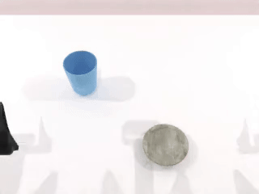
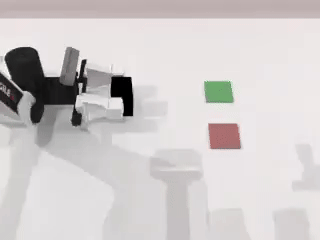

# AIR-5021-TeamX-FinalProject

# Installation
> Please note that you need to strictly follow the steps: **Modify `mplib` Library Code** and **Download Assert**.

Clone this Repo:
```
git clone https://github.com/HaochengWang23//AIR-5021-Team6-FinalProject.git
```

See [INSTALL.md](./INSTALL.md) for installation instructions. 

# Usage 
## 1. Task Running and Data Collection
Running the following command will first search for a random seed for the target collection quantity (default is 100), and then replay the seed to collect data.

```
bash run_task.sh ${task_name} ${gpu_id}
# As example: bash run_task.sh empty_cup_place 0
```

<table>
  <tr>
    <td></td>
    <td></td>
    <td></td>
  </tr>
  <tr>
    <td></td>
    <td></td>
    <td></td>
  </tr>
</table>


## 2. Task Config
> It is recommended to view [Config Tutorial](./CONFIG_TUTORIAL.md) for more details.

Data collection configurations are located in the `config` folder, corresponding to each task. 

For the official evaluation, all cameras are designated as D435, and the point cloud is downsampled to 1024 by default. You can see its configuration in `task_config/_camera_config.yml`.

# Baselines

## 1. 3D-Diffusion Policy
The 3D-Diffusion-Policy (DP3) code can be found in `policy/3D-Diffusion-Policy`.

Install 3D-Diffusion-Policy
```
pip install -r policy/3D-Diffusion-Policy/requirement.txt
```

Process Data for DP3 training after collecting data (In root directory)
```
python script/pkl2zarr_dp3.py ${task_name} ${expert_data_num}
# As example: python script/pkl2zarr_dp3.py empty_cup_place 100, which indicates preprocessing of 100 `empty_cup_place` task trajectory data.
```

Then, move to `policy/3D-Diffusion-Policy` first, and run the following code to train DP3. The model will be trained for 3000 epochs:
```
bash train.sh ${task_name} ${expert_data_num} ${seed} ${gpu_id}
# As example: bash train.sh empty_cup_place 100 0 0
```

Run the following code in the **Project Root** to evaluate DP3 for a specific task for 100 times:
```
bash eval_policy.sh ${policy_name} ${task_name} ${ckpt_folder} ${gpu_id}
# As example: bash eval_policy.sh 3D-Diffusion-Policy empty_cup_place empty_cup_place_D435_50_0 0
```
